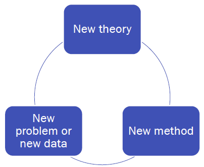

# Making a contribution

!!! quote
    The important issue is not how __many__ contributions a study will make, but rather a __significance__ for each.

 

* **Test the assumptions**
    * … on which a significant stream of research relies

    * Taking a step back and identify core assumptions

* Probe the external validity
    * … of what we take to be true
    * Common background factors?

* The next new thing
    * Open new domains of inquiry
    * Make sure that this domain has significant implications if it was better understood

* Work backward in the causal chain
   * Examine a variable, that if understood better, 
      has major implications for a vast nest of relationships

* Intervene in an accepted causal chain
    * Taken-for-granted relationships? But really, really? What happens if they disappear?

* Challenging conventional managerial practices/beliefs

* Resolve inconsistent findings
    * Requires taking a step back…
    * Examine a stream of research in a holistic fashion
    * Focus on subtleties, that may have not so subtle implications

## Do you have a contribution?!

|  a) Three questions-pitch |       b) Elevator pitch       |
| --------                  |--------                        | 
| * Answer the following three questions about your research.| * Imagine yourself going in the elevator and meeting the Rector of Tilburg University, who asks you to tell him what your MSc research is about…right-aligned             | 
| 1. What’s new about it?   • E.g., new data? new variables? new method?  |   Have only 1-2 sentences, adhering to one of the following two structure: | 
|2. Is it useful (and to whom?)|                            | 
|3. Is it interesting? • Simply telling something everyone knows already isn’t interesting (known facts ≠ interesting)                           |   While ..., our research shows that...    Despite …, we find that… | 
|• Phenomenon, Gap, Aha!    |                     | 
|• Would you get your friends excited about it?!      |                    | 

!!! tip
    Your pitch won’t be perfect at the first time –
    so practice it over and over again – until you really become enthusiastic about it!