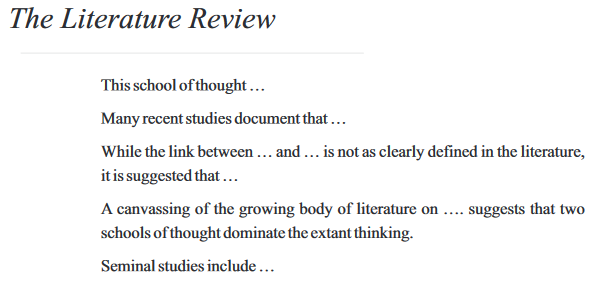
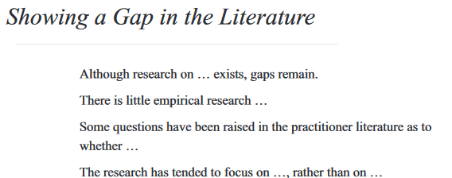
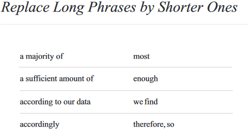

# Literature Review

!!! note ""
      Elaborate discussion “what do we know”/”not know” and
      contribution (“what do you add to the literature”)

# Wrong Approach
  *  Study A finds 1
  *  Study B finds 2
  *  Study C finds 1
  *  Study D finds 1+2
  *  Study E finds 3
  *  Study F finds 4
  *  My study contributes to the literature by doing x, y,
    and z.

# Correct approach
  * First stream of literature is concerned with 1.
      * Study A supports 1 (+ argument used in study)
      * Study C adds to it (+ argument used in study),
        providing further evidence for 1.
      * **But**, they miss out on x ( -> contribution!)
  * Second stream of literature is concerned with 2.
      * For example, study B and D find 2, while study D
        even supports 1.
      * **But**, they miss out on y ( -> contribution!)
  * Third stream deals with related phenomena.
      * Study E finds 3 (+ why it’s important to your study)
      * Study F finds 4 (+ why it’s important to your study)
      * **But**, they miss out on z ( -> final contribution!)

!!! summary
    Key is to synthesize the literature!

* Most students I talk to enjoy writing their literature review section least.
* So, make it a little more fun by using a few “stock phrases” this will help you to submit a polished draft as opposed to a lousy set of basic sentences.
* As a preview, see this: 

##  Example:

## The Literature Review
  This school of thought.... 
  Many recent studies document that... 
  While the link between...and....is not as clearly defined in the literature, it is suggested that.... 
  A canvassing of the growing body of literature on... suggests that two schools of thought dominate the extant thinking. 
  Seminal studies include... 

## Showing a Gap in the literature
  Although research on...exists, gaps remain. 
  There is little empirical research... 
  Some questions have been raised in the practitioner literature as to whether.... 
  The research has tended to focus on....,rather on..... 

## Replace Long Phrases by Shorter Ones

|                       |              | 
| :---------            | :------:     | 
| a majority of         | most         | 
|a sufficient amount of |enough        |
|according to our data  |we find       |
|accordingly            | therefore, so|

<!-- 

 -->

* More to be found [here ](tiu.nu/writing)

# Visualizing your contribution
{: style="height:300px;width:600px"} 

{: style="height:300px;width:600px"}

Ataman[^1] 

[^1]:
Ataman, Berk, Harald J. van Heerde, Carl. F. Mela (2010), “The Long term Effect of Marketing Strategy on Brand Sales,”, Journal of Marketing Research.

!!! warning
    (Please not that your table may have different column headings than this one!)
