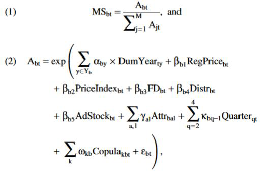
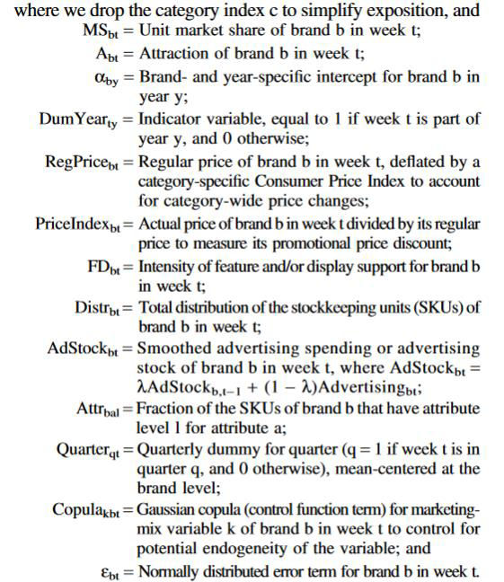

# Method

* Typically, you will describe your model in a formula, and an accompanying text, e.

Source[^1] 
[^1]:
Source: Hannes Datta, Kusum L. Ailawadi, and Harald J. van Heerde (2017) How Well Does Consumer-Based Brand Equity Align with Sales-Based Brand Equity and Marketing-Mix Response?. Journal of
Marketing: May 2017, Vol. 81, No. 3, pp. 1-20.

* Pay attention to use the correct sub indexes (e.g., i for consumers, j for categories, t for time, etc.)    – not everything will be ijt!!!