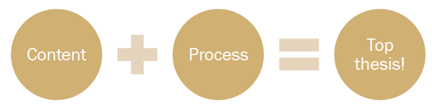

# Master thesis guide

!!! warning
	This page is currently under development. Please do not use this material until further notice.
	

These website should help you to get started in

- ...
- ...

@Hannes, include some text here.

!!! tip 
	* Rather then seeing this page as a one-time exercise, we encourage you to bookmark it and come back to it frequently.
	* If you find any outdated content, links or unclear descriptions, email us at [h.datta@tilburguniversity.edu]() so that we can update the instructions or clarify as needed.
	* Please also view [https://hannesdatta.github.io/reproducible-science-guide/]() for tips how to set up your computer and how to manage workflows for data- and computation-intensive projects!
	